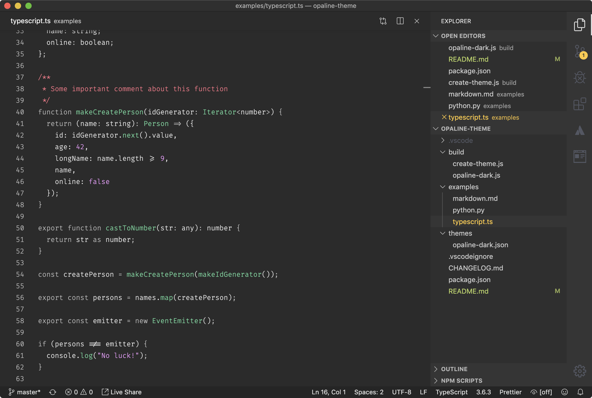
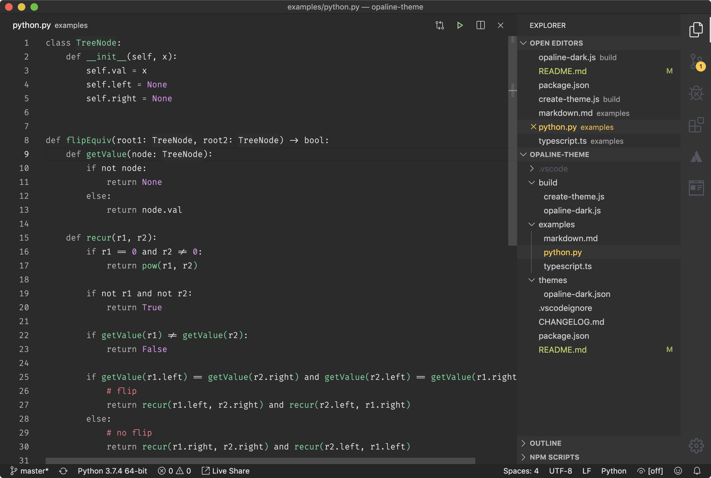
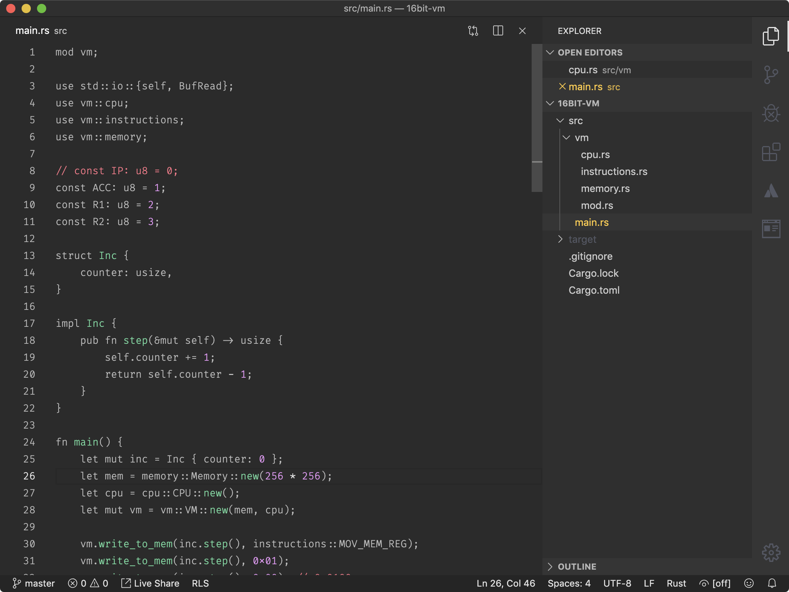

# Opaline Theme

## Features

- High contrast theme AA (4.5+)
- Minimal syntax highlighting inspired by Alabaster
- Special treatment for: JavaScript, TypeScript, Python, Rust
- Dark and Light variants (TODO)
- Optional icon theme (TODO)

Know issues:

- Tabs are not really been tested for the MVP. (TODO)

### Minimal syntax highlighting

This theme explores an idea of reducing amount of syntax highlighting and focusing on code more rather than having a cristmas tree of an editor.

Opaline defines 5 categories of tokens for syntax highlighting:

1. Language Keywords
2. Literals – constants, regexp, boolean, strings, numbers, etc...
3. Functions – functions, classes, types...
4. Attention seekers – anything that requires as much attention as possible – comment, debugger statements, etc...
5. Everything else

### Screenshots

#### TypeScript / JavaScript

#### Python

#### Rust

### Credits

- [Alabaster](https://github.com/tonsky/vscode-theme-alabaster) – inspiration for syntax highlighting
- [Andy Bell's website](https://hankchizljaw.com/) – ideas for colors
